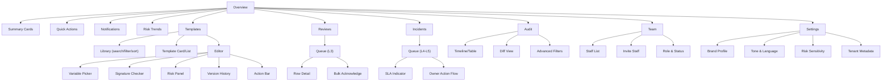

# Navigation Map (Pilot 0.1)

```mermaid
graph TD
  O["Overview"] --> O1["Summary Cards"]
  O --> O2["Quick Actions"]
  O --> O3["Notifications"]
  O --> O4["Risk Trends"]

  T["Templates"] --> T1["Library (search/filter/sort)"]
  T --> T2["Template Card/List"]
  T --> T3["Editor"]
  T3 --> T31["Variable Picker"]
  T3 --> T32["Signature Checker"]
  T3 --> T33["Risk Panel"]
  T3 --> T34["Version History"]
  T3 --> T35["Action Bar"]

  R["Reviews"] --> R1["Queue (L3)"]
  R1 --> R2["Row Detail"]
  R1 --> R3["Bulk Acknowledge"]

  I["Incidents"] --> I1["Queue (L4-L5)"]
  I1 --> I2["SLA Indicator"]
  I1 --> I3["Owner Action Flow"]

  A["Audit"] --> A1["Timeline/Table"]
  A --> A2["Diff View"]
  A --> A3["Advanced Filters"]

  TM["Team"] --> TM1["Staff List"]
  TM --> TM2["Invite Staff"]
  TM --> TM3["Role & Status"]

  S["Settings"] --> S1["Brand Profile"]
  S --> S2["Tone & Language"]
  S --> S3["Risk Sensitivity"]
  S --> S4["Tenant Metadata"]

  O --> T
  O --> R
  O --> I
  O --> A
  O --> TM
  O --> S
```

## Två-klicksregel
- Overview → valfri huvudsektion: 1 klick
- Huvudsektion → detalj/åtgärd: 1 klick
- Total: max 2 klick till kritiska funktioner

