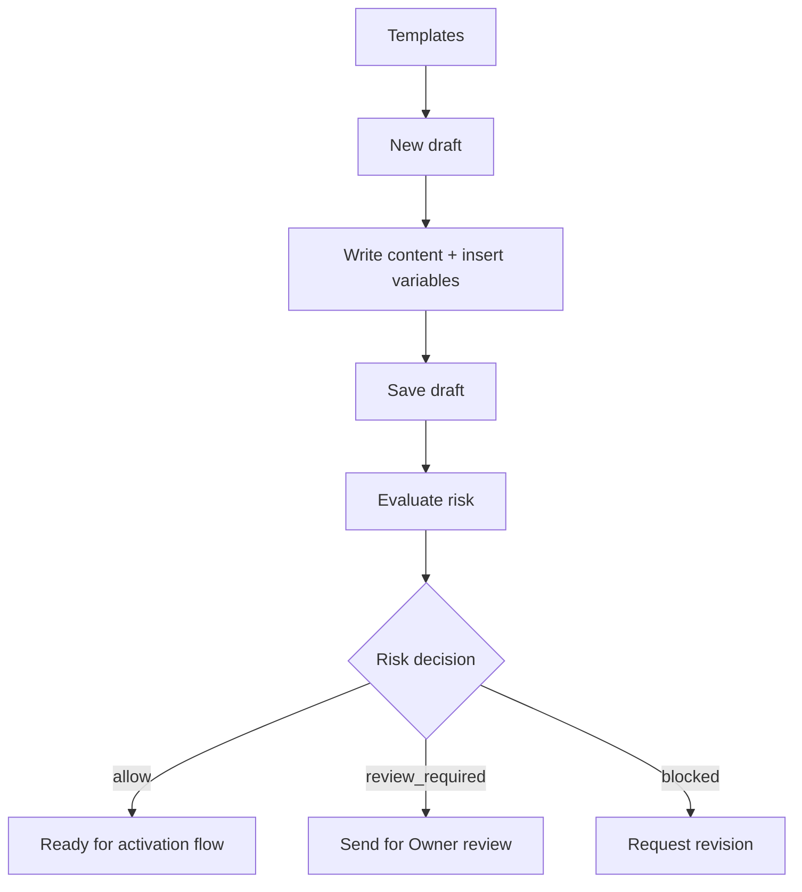
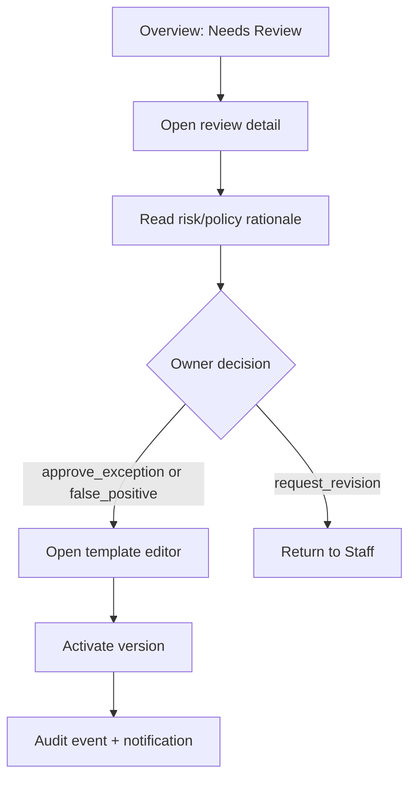
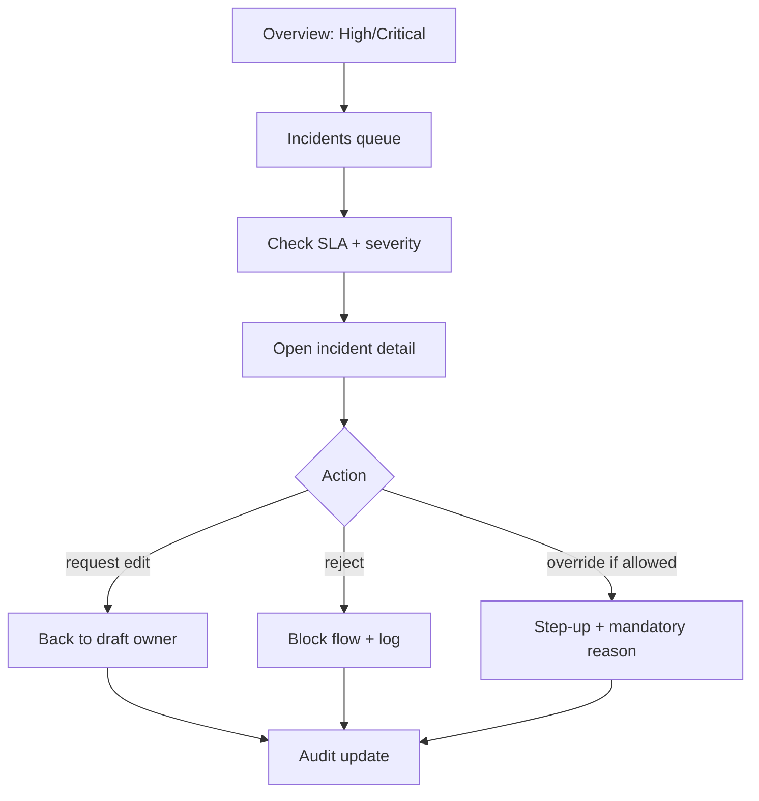
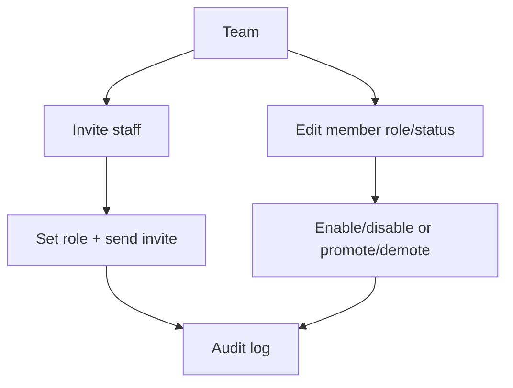

# User Journeys (Pilot 0.1)

## 1) Staff — Create and evaluate draft

```mermaid
flowchart TD
  A["Templates"] --> B["New draft"]
  B --> C["Write content + insert variables"]
  C --> D["Save draft"]
  D --> E["Evaluate risk"]
  E --> F{"Risk decision"}
  F -->|allow| G["Ready for activation flow"]
  F -->|review_required| H["Send for Owner review"]
  F -->|blocked| I["Request revision"]
```

## 2) Owner — Approve and activate template

```mermaid
flowchart TD
  A["Overview: Needs Review"] --> B["Open review detail"]
  B --> C["Read risk/policy rationale"]
  C --> D{"Owner decision"}
  D -->|approve_exception or false_positive| E["Open template editor"]
  D -->|request_revision| F["Return to Staff"]
  E --> G["Activate version"]
  G --> H["Audit event + notification"]
```

## 3) Owner — Handle high/critical incident

```mermaid
flowchart TD
  A["Overview: High/Critical"] --> B["Incidents queue"]
  B --> C["Check SLA + severity"]
  C --> D["Open incident detail"]
  D --> E{"Action"}
  E -->|request edit| F["Back to draft owner"]
  E -->|reject| G["Block flow + log"]
  E -->|override if allowed| H["Step-up + mandatory reason"]
  F --> I["Audit update"]
  G --> I
  H --> I
```

## 4) Owner — Team management

```mermaid
flowchart TD
  A["Team"] --> B["Invite staff"]
  B --> C["Set role + send invite"]
  A --> D["Edit member role/status"]
  D --> E["Enable/disable or promote/demote"]
  C --> F["Audit log"]
  E --> F
```

